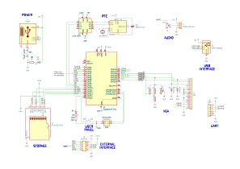
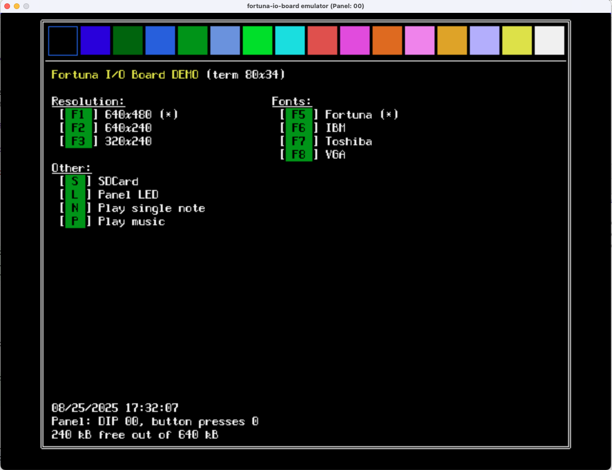

# Fortuna IO board

**Fortuna I/O board** is a board that provides multiple I/O ports, and can be used to build a custom computer.


The board main component is a [Raspberry Pi Pico 2 W](https://www.raspberrypi.com/products/raspberry-pi-pico-2/), which
has 2 processor cores. The 2nd core is used for managing the board I/O, leaving the 1st board available for whatever
the user decides to implement.

The board and accompanying firmware library provides:

 - 1 Raspberry Pi Pico 2 W core available for user implementation (3.8 MB flash and 350 kB RAM free)
 - USB power with on/off switch
 - VGA output at 640x480, 640x240 or 320x240 in 16 colors
 - special VGA mode at 320x240 with a background framebuffer + sprites (mode 4)
 - VGA text with 4 different fonts
 - support for USB keyboard
 - SD Card storage (using the libraries and [no-OS-FatFS-SD-SDIO-SPI-RPi-Pico](https://github.com/carlk3/no-OS-FatFS-SD-SDIO-SPI-RPi-Pico) and [FatFs](https://elm-chan.org/fsw/ff/))
 - Real Time (calendar) clock with long term storage, battery operated (CR2032)
 - UART interface (can be used with a FTDI cable)
 - audio output via headphone jack
 - user panel composed of two leds, one pushbutton and 2x microswitch
 - an external SPI interface (via a 5x2 pin IDC connector), allowing the board to be controller externally
 - Wi-Fi and Bluetooth via Pico Pi 2 W

## Schematic



Possible variations:
 * Any of these modules, except for the Pico Pi 2 and the Power, are optional.
 * A Pico Pi (not W) can be used instead, if wireless is not needed.

[Download PDF](schematic/pi-pico-vga.pdf)

## Using it in a project

Look at `firmware/io-board/CMakeLists.txt` and `firmware/io-board/demo.c` for an example on how to import and use the library.

## Building the demo

To build the demo:

```shell
mkdir -p firmware/io-board/build
cd firmware/io-board/build
cmake -DPICO_SDK_PATH=~/pico-sdk -DPICOTOOL_FETCH_FROM_GIT_PATH=~/picotool -DPICO_BOARD=pico2 ..   # replace with your directories
make
```

# Emulator



An emulator can be used to test the implementation without having to upload it to the board. To build the emulator:

```shell
mkdir -p emulator/build
cd emulator/build
cmake ..
make
```

The same code that is uploaded to the board can also be used to compile the emulator. Look at `emulator/io-board/demo.c`,
which is just a link to the firmware implementation.

To create a disk image to use in the emulator, use the script `/tools/sdcard/create_image.sh`. To manage the disk image
(copy files to it, etc), the disk image needs to be mounted. In Linux, do 
`mount -o loop MY_IMAGE MOUNT_POINT`; in Mac, do `hdiutil attach MY_IMAGE` and access it through Finder.

(Macs needs to have `dosfstools` installed to use the `create_image.sh` script)